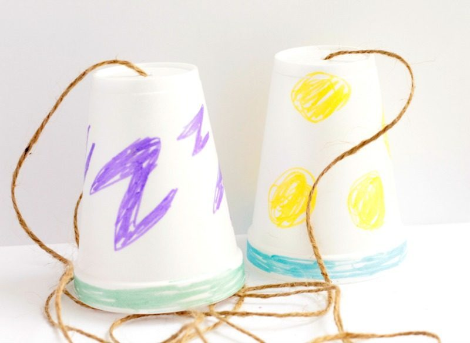

# Cups and String
A container overlay network for all of your non-production needs. A fun project for getting down and dirty with TUN interfaces and their relationship with linux IP routing rules.



## What it does
In brief, given networked machines or VMs, this network applies a UDP overlay so that the containers on those machines can communicate with one another as if they are on the same machine. The containers will believe they are talking to sibling containers on their machine, when in reality these are cousin containers on an entirely different host.

## Why this might be useful
In large container orchestration systems such as Kubernetes, we might run many virtual machines. My `user` service might be running in a container on any one or more of those VMs. We might have a service discovery mechanism to find the IP of one of those container instances. My `auth` service should be able to retrieve the IP for the `user` service and make a request to it directly. It should not need awareness of the VM on which that container is running. It should not need to know that it is on a different machine at all. Equally, the machines should not need to change their settings on a per-container basis.

An overlay network allows container-to-container requests agnostic of network architecture by running sidecar to service applications. It alone is aware of the VM-container relationships of a particular containerised system. This complexity is abstracted out of the application, so that when the network changes, the machines changes or the containers move, the services are unphased.

## How the Overlay Works

### The Setup
- Two machines, running on the same local network. They can ping one another directly.
- Each machine is running a docker container.

### Without the overlay
These containers cannot see one another. They run on networks isolated inside their hosts.
A request from one container using the IP of the other will not resolve. The IP is not available on the network of the container or its host. It has no interface with a subnet that matches.

### The Life of a request
A request from container A on machine A to container B on machine B. Container B is running nginx.
1) From container A we make an HTTP request, perhaps using `curl`, or else from within the body of an application running there. The request is made to the IP of container B, which we may have retrieved via DNS or service discovery of some sort.
2) The request in container A passes from the Docker bridge network to the host. The host machine takes the IP and checks it against its routing rules.
3) The overlay service creates a TUN interface on each machine. It has a subnet which matches all containers allocated across all machines within the overlay. This is achieved by orchestrating Docker to allocate a specific set of IPs on each machine. This means that any outbound traffic to any container will match the routing rule for the TUN interface, and it will be passed the IP packet.
4) The TUN interface is read by the overlay service application. You can see the code for reading the packets enclosed in the files above. It parses the IP packet, to find the destination IP of the outbound packet. In this case the destination IP is the IP belonging to container B.
5) We configure docker to allocate container IPs such that the 3rd byte identifies the "node number" of the machine it is running on. The node number is an arbitrary, unique integer which can be mapped to the machine's IP address. Each machine is furnished with a copy of received, we can easily determine the machine on which the destination container, in this case container B, is running.
6) Now we know the IP of container B's host. We wrap the IP packet in a UDP packet, and make a UDP request to the host node, machine B, on port 8285.
7) Machine B is running a UDP listening on port 8285. It receives our request and unwraps the IP packet.
8) It too is running a TUN interface, as all nodes on the overlay do. It writes this inbound IP packet to the TUN interface, which is read at the other end at the kernel.
9) Here we have to be careful to accurately configure the ip table settings of the machines. We have to allow IP forwarding of ip packets from TUN, so the kernel is prepared to pass them on. Also, because the IP subnet of the containers is a shared pattern across nodes, the source IP of this packet, which is the IP of container A, looks very similar to local addresses the kernel has on its own machine. When this is the case, the packet is at risk of being marked a "martian packet" and dropped.
10) We setup a more specific subnet for the Docker network on each host, so that it matches the first 24 bits of its container IPs, achieved because the 3rd byte is the known node number of that machine. This means that, although inbound packets have a match with the TUN from which it originated into the kernel, the Docker interface has the better match. The kernel will therefore forward the packet into the Docker network, where it will be routed to the container for which it is destined.
11) At this point, our http request reaches port 80 at container B, where it can be served by the application there. This is to ignore the TCP handshake that will have to occur before the HTTP request is actually delivered, or indeed answered. Each of those packets is delivered by exactly the same means.
12) Once container B is ready to respond to the container A's request, that will be wrapped into an IP packet. This time the destination address will be the source address of the arriving packet - container A's IP. Then the process repeats itself. Out to machine B's kernel, into the TUN, over UDP back to machine A, and routed back to container A.


## What you'll find here
As well as the service itself, there's a full CLI for configuring all of the network setting necessary to make this work.

## Requirements
On each machine you'll need a user which at a minimum does not need a password to run some systemctl commands. You can use this template, replacing `$USER` with your username:

```sh
%$USER ALL= NOPASSWD: /bin/systemctl start overlay.service
%$USER ALL= NOPASSWD: /bin/systemctl start overlay
%$USER ALL= NOPASSWD: /bin/systemctl restart overlay.service
%$USER ALL= NOPASSWD: /bin/systemctl restart overlay
%$USER ALL= NOPASSWD: /bin/systemctl stop overlay.service
%$USER ALL= NOPASSWD: /bin/systemctl stop overlay
```

Write this to the following file on the target machine, again replacing `$USER` with your username:
`/etc/sudoers.d/\$USER`. This will make you a sudoer for these systemctl commands, allowing the scripts to set up and deploy the overlay service on your behalf.

You will need Docker installed on each machine in the overlay.

Also, this has only been tested on Ubuntu machines. It should work on most mainstream Linux distributions.

## Warnings

This changes the IP routes and rules on each machine it is applied to. Apply with care. I cannot take responsibility for any issues caused by these scripts or programs. Be sure to read through them first, to understand the changes they are making, and to ensure you are happy with them.

## How to get started
Before doing anything else run:
```sh
./configure
```
This will put the scripts and the service itself into reachable locations. You may need to run this with `sudo` as it uses `/etc/` dir. This will also install `cups-and-string` cli.


#### Create a new network.
```sh
cups-and-string create overlay
```
Name your network for reference later.

#### Add a node.
```sh
cups-and-string create node
```
**Warning: this will stop Docker and change the IPs of its containers.**

Specify the overlay network you want to add to. Provide a reachable IP for the node & a sudoer user as outlined above. This will create the node number for the new node, assign it a place on the container subnet, create the systemd service for the overlay application, add the Docker settings required, generate the IP routing and table rules, pass to it the data it needs on the other nodes in the network, and create the all-important TUN interface. Finally, it will start running the application, listening on the TUN interface and on port 8285 for UDP packets.
